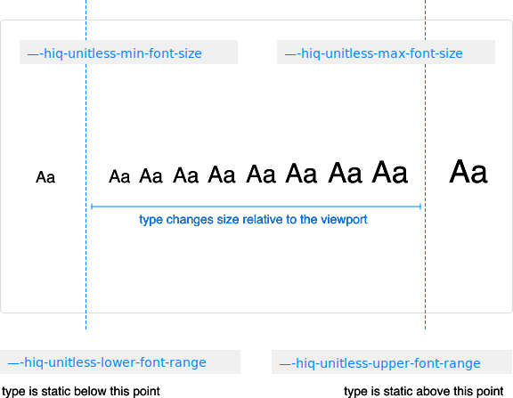

# Typography

## Global settings

HiQ sets several global typographic settings:

* Adjustments of font size after orientation changes on some mobile devices is prevented by setting `text-size-adjust` to `100%`.
* `text-rendering` is set to `optimizeLegiblity` to emphasize legibility over rendering speed or geometric precision. This enables kerning and optional ligatures.

Some additional options are set globally and are customizable with custom properties.

<PropertiesTable category="global-typography-settings" />

## Font families

By default, a native font stack is used as the font family on the `html` element, which allows for optimum text rendering on every device and operating system.

```css
:root {
    --hiq-base-font-family:
        /* Safari for OS X and iOS (San Francisco) */
        -apple-system,
        /* Chrome < 56 for OS X (San Francisco) */
        BlinkMacSystemFont,
        /* Windows */
        'Segoe UI',
        /* Android */
        'Roboto',
        /* Basic web fallback */
        'Helvetica Neue', Arial, sans-serif;
}
```

The `--hiq-base-font-family` is defined on the `html` element and automatically inherited through HiQ. You can change the global `font-family` as well as monospace family, which is used on code elements.

<PropertiesTable category="font-families" />

### Adding Font Families

If you are using additional font families, for example a serif family, simply add a new custom property:

```css
:root {
  --font-family-serif: 'Chronicle Display', 'Lucida Grande', Verdana, Helvetica, sans-serif;
}
```

::: tip
We recommend that you similarly add a new custom property for each new font stack you plan to use.
:::

## Responsive typography

Typography in HiQ is truly fluid, meaning that it is not simply defined at various breakpoints, but is a function of viewport width.

<figure>
    
</figure>

The root font size, set on the `html` element is determined by a formula that looks like this:

<samp>min font size + (max font size - min font size) * (viewport width - lower font range) / (upper font range - lower font range)</samp>

There are four values you can customize that will tweak the behavior of the responsive type.

<PropertiesTable category="responsive-typography" />

In order to fully alter this behavior, you must be pulling in the source HiQ files into your project with PostCSS. This will allow you to change two custom media queries that set lower and upper bounds on the type size changes.

Simply include these two custom media query definitions as you would custom properties, and change them to match your `--hiq-unitless-lower-font-range` and `hiq-unitless-upper-font-range` values, with the addition of `px` units.

```css
/* matches value of --hiq-unitless-lower-font-range */
@custom-media --lower-font-range (min-width: 460px);

/* matches value of --hiq-unitless-upper-font-range */
@custom-media --upper-font-range (min-width: 900px);
```

::: tip
We recommend setting the `--upper-font-range` to the same value as your max computed container size.
:::

Here's a full example:

```css
:root {
  /* my max container width */
  --hiq-max-container-width: 50rem;

  /* my minimum font size */
  --hiq-unitless-min-font-size: 15;
  /* my maximum font size */
  --hiq-unitless-max-font-size: 18;

  /* below this point, the minimum font size will be used */
  --hiq-unitless-lower-font-range: 460;
  /*
  above this point, the maximum font size will be used
  I get 900 by multiplying 50 (max container width) by 18px (max font size)
  */
  --hiq-unitless-upper-font-range: 900;
}

/* matches my lower font range */
@custom-media --hiq-lower-font-range (min-width: 460px);
/* matches my upper font range */
@custom-media --hiq-upper-font-range (min-width: 900px);
```

<BrowserBugs category="responsive-typography" />

## Type scale

Six type sizes are provided by default. These correspond to the six heading levels, but are not necessarily heading sizes and can be used anywhere.

`.is-size-1` through `.is-size-6` classes are available. They are also available as mixins, if you are using the source files with PostCSS.

<CodeExample>
<p class="is-size-1" style="margin: 0;">Font size 1</p>
<p class="is-size-2" style="margin: 0;">Font size 2</p>
<p class="is-size-3" style="margin: 0;">Font size 3</p>
<p class="is-size-4" style="margin: 0;">Font size 4</p>
<p class="is-size-5" style="margin: 0;">Font size 5</p>
<p class="is-size-6" style="margin: 0;">Font size 6</p>
</CodeExample>

```html
<p class="is-size-1">Font size 1</p>
<p class="is-size-2">Font size 2</p>
<p class="is-size-3">Font size 3</p>
<p class="is-size-4">Font size 4</p>
<p class="is-size-5">Font size 5</p>
<p class="is-size-6">Font size 6</p>
```

```css
@mixin is-size-1;
@mixin is-size-2;
@mixin is-size-3;
@mixin is-size-4;
@mixin is-size-5;
@mixin is-size-6;
```

`--hiq-font-size-base` controls the default sizing on the `html` element. `--hiq-font-size-large` and `--hiq-font-size-small` provide additional, semantically clear sizing options.

```css
@mixin is-size-large;
@mixin is-size-small;
```

All sizes are defined with `rems`, which are relative to the root font size defined on the `html` element (see above for information about the responsive nature of this root size).

<PropertiesTable category="type-scale" />

If these six sizes are not enough for your project, simply add additional custom properties and use as needed.

```css
:root {
  --font-size-7: 0.75rem;
}
```

## Headings

All HTML headings, `<h1>` through `<h6>`, are sized according to the six provided type sizes.

<table>
  <thead>
    <tr>
      <th>Heading</th>
      <th>Example</th>
    </tr>
  </thead>
  <tbody>
    <tr>
      <td>
        <code>&lt;h1&gt;&lt;/h1&gt;</code>
      </td>
      <td><p class="is-size-1" style="margin: 0;">Heading 1</p></td>
    </tr>
    <tr>
      <td>
        <code>&lt;h2&gt;&lt;/h2&gt;</code>
      </td>
      <td><p class="is-size-2" style="margin: 0;">Heading 2</p></td>
    </tr>
    <tr>
      <td>
        <code>&lt;h3&gt;&lt;/h3&gt;</code>
      </td>
      <td><p class="is-size-3" style="margin: 0;">Heading 3</p></td>
    </tr>
    <tr>
      <td>
        <code>&lt;h4&gt;&lt;/h4&gt;</code>
      </td>
      <td><p class="is-size-4" style="margin: 0;">Heading 4</p></td>
    </tr>
    <tr>
      <td>
        <code>&lt;h5&gt;&lt;/h5&gt;</code>
      </td>
      <td><p class="is-size-5" style="margin: 0;">Heading 5</p></td>
    </tr>
    <tr>
      <td>
        <code>&lt;h6&gt;&lt;/h6&gt;</code>
      </td>
      <td><p class="is-size-6" style="margin: 0;">Heading 6</p></td>
    </tr>
  </tbody>
</table>

<PropertiesTable category="headings" />

## Line height

Base line height is defined on the `html` element with the `--hiq-line-height-base` custom property. Headings (`h1` through `h6`) receive a variant line height defined by `--hiq-heading-line-height`.

<PropertiesTable category="line-height" />

## Font weights

Five font weights are available as classes and mixins.

<CodeExample>
<p class="has-font-weight-light">Font weight light</p>
<p class="has-font-weight-normal">Font weight normal</p>
<p class="has-font-weight-medium">Font weight medium</p>
<p class="has-font-weight-semibold">Font weight semibold</p>
<p class="has-font-weight-bold">Font weight bold</p>
</CodeExample>

```html
<p class="has-font-weight-light">Font weight light</p>
<p class="has-font-weight-normal">Font weight normal</p>
<p class="has-font-weight-medium">Font weight medium</p>
<p class="has-font-weight-semibold">Font weight semibold</p>
<p class="has-font-weight-bold">Font weight bold</p>
```

```css
@mixin has-font-weight-light;
@mixin has-font-weight-normal;
@mixin has-font-weight-medium;
@mixin has-font-weight-semibold;
@mixin has-font-weight-bold;
```

By default, font weights are set to the most common values defined for web fonts. These can be customized using custom properties.

Custom properties are also used to apply the font weights to various elements. By default, `--hiq-font-weight-normal` is set on the `html` element. This is defined by the `--hiq-font-weight-base` custom property.

<PropertiesTable category="font-weights" />

## Inline text elements

Styling for common inline HTML5 elements:

<table>
  <thead>
    <tr>
      <th>Element</th>
      <th>Example</th>
    </tr>
  </thead>
  <tbody>
    <tr>
      <td>
        <code>&lt;strong&gt;&lt;b&gt;</code>
      </td>
      <td><strong>This is strong text</strong></td>
    </tr>
    <tr>
      <td>
        <code>&lt;em&gt;&lt;i&gt;</code>
      </td>
      <td><em>This is emphasized text</em></td>
    </tr>
    <tr>
      <td>
        <code>&lt;u&gt;</code>
      </td>
      <td><u>This is underlined text</u></td>
    </tr>
    <tr>
      <td>
        <code>&lt;s&gt;</code>
      </td>
      <td><s>This is strikethrough text</s></td>
    </tr>
    <tr>
      <td>
        <code>&lt;small&gt;</code>
      </td>
      <td><small>This is small text</small></td>
    </tr>
    <tr>
      <td>
        <code>&lt;sup&gt;</code>
      </td>
      <td><sup>This is superscript text</sup></td>
    </tr>
    <tr>
      <td>
        <code>&lt;sub&gt;</code>
      </td>
      <td><sub>This is subscript text</sub></td>
    </tr>
    <tr>
      <td>
        <code>&lt;var&gt;</code>
      </td>
      <td><var>This is variable text</var></td>
    </tr>
    <tr>
      <td>
        <code>&lt;dfn&gt;</code>
      </td>
      <td><dfn>This is definition text</dfn></td>
    </tr>
    <tr>
      <td>
        <code>&lt;abbr&gt;</code>
      </td>
      <td><abbr title="abbreviation">This is abbreviation text</abbr></td>
    </tr>
    <tr>
      <td>
        <code>&lt;del&gt;</code>
      </td>
      <td><del>This is deleted text</del></td>
    </tr>
    <tr>
      <td>
        <code>&lt;ins&gt;</code>
      </td>
      <td><ins>This is inserted text</ins></td>
    </tr>
    <tr>
      <td>
        <code>&lt;mark&gt;</code>
      </td>
      <td><mark>This is marked text</mark></td>
    </tr>
  </tbody>
</table>

<PropertiesTable category="inline-text-elements" />

## User selection

The background color of a user's selection can be customized using the `--hiq-selection-color` custom property.

<PropertiesTable category="user-selection" />

## Address

The `<address>` element is updated to reset the browser default `font-style` from italic to normal. `line-height` is also now inherited, and `margin-bottom: 1rem` has been added.

<CodeExample>
<address>
    <strong>WHQ</strong><br>
    2518 W Armitage Ave<br>
    Chicago IL 60647<br>
    <abbr title="Phone">P:</abbr> (123) 456-7890
</address>
</CodeExample>

```html
<address>
    <strong>WHQ</strong><br>
    2518 W Armitage Ave<br>
    Chicago IL 60647<br>
    <abbr title="Phone">P:</abbr> (123) 456-7890
</address>
```

## Lists

All lists—`<ul>`, `<ol>`, and `<dl>`—have their `margin-top` removed and `margin-bottom: 1rem` added. Nested lists have no `margin-bottom`.

<CodeExample>
<ul>
    <li>Unordered list item 1</li>
    <li>Unordered list item 2</li>
    <li>Unordered list item 3
        <ul>
            <li>Nested list item 1</li>
            <li>Nested list item 2</li>
            <li>Nested list item 3</li>
        </ul>
    </li>
</ul>
<ol>
    <li>Ordered list item 1</li>
    <li>Ordered list item 2</li>
    <li>Ordered list item 3</li>
</ol>
</CodeExample>

```html
<ul>
    <li>Unordered list item 1</li>
    <li>Unordered list item 2</li>
    <li>Unordered list item 3
        <ul>
            <li>Nested list item 1</li>
            <li>Nested list item 2</li>
            <li>Nested list item 3</li>
        </ul>
    </li>
</ul>
<ol>
    <li>Ordered list item 1</li>
    <li>Ordered list item 2</li>
    <li>Ordered list item 3</li>
</ol>
```

<PropertiesTable category="lists" />

### Unstyled

Remove the default `list-style` and `margin-left` on list items (immediate children only) with `.is-unstyled`. This only applies to immediate children list items, meaning you will need to add the class for any nested lists as well.

<CodeExample>
<ul class="is-unstyled">
    <li>Unstyled list item 1</li>
    <li>Unstyled list item 2</li>
    <li>Unstyled list item 3
        <ul>
            <li>Nested list item 1</li>
            <li>Nested list item 2</li>
            <li>Nested list item 3</li>
        </ul>
    </li>
    <li>Unstyled list item 4</li>
    <li>Unstyled list item 5</li>
    <li>Unstyled list item 6</li>
</ul>
</CodeExample>

```html
<ul class="is-unstyled">
    <li>Unstyled list item 1</li>
    <li>Unstyled list item 2</li>
    <li>Unstyled list item 3
        <ul>
            <li>Nested list item 1</li>
            <li>Nested list item 2</li>
            <li>Nested list item 3</li>
        </ul>
    </li>
    <li>Unstyled list item 4</li>
    <li>Unstyled list item 5</li>
    <li>Unstyled list item 6</li>
</ul>
```

There is also a mixin available for this:

```css
ul {
  @mixin is-unstyled;
}
```

### Inline

Make a list's items inline with `.has-inline-children` or the matching mixin. This will also apply some `margin-right` to the items to space them out. Note that you will need to also use the `.is-unstyled` class to remove bullets.

<CodeExample>
<ul class="has-inline-children is-unstyled">
    <li>Inline list item 1</li>
    <li>Inline list item 2</li>
    <li>Inline list item 3</li>
</ul>
</CodeExample>

```html
<ul class="has-inline-children is-unstyled">
    <li>Inline list item 1</li>
    <li>Inline list item 2</li>
    <li>Inline list item 3</li>
</ul>
```

```css
@mixin has-inline-children;
```

<PropertiesTable category="inline-lists" />

### Description Lists

For simpler styling, clear hierarchy, and better spacing, description lists have updated margins. By default, `<dd>`s reset `margin-left` to `0` and add `margin-bottom: 0.5rem`. `<dt>`s are bolded.

<CodeExample>
<dl>
    <dt>Description term</dt>
    <dd>Description</dd>
    <dt>Another description term</dt>
    <dd>
        <dl>
            <dt>Nested description term</dt>
            <dd>Description</dd>
        </dl>
    </dd>
</dl>
</CodeExample>

```html
<dl>
    <dt>Description term</dt>
    <dd>Description</dd>
    <dt>Another description term</dt>
    <dd>
        <dl>
            <dt>Nested description term</dt>
            <dd>Description</dd>
        </dl>
    </dd>
</dl>
```

<PropertiesTable category="description-lists" />

## Blockquote

For quoting blocks of content from another source within your document. Wrap `<blockquote>` around any HTML as the quote.

Wrap the name of the source of the quote in `<cite>`.

<CodeExample>
<blockquote>
    <p>A block quotation is a quotation that is offset from the main text as a paragraph, or block of text.</p>
    <cite>Quote citation</cite>
</blockquote>
</CodeExample>

```html
<blockquote>
    <p>A block quotation is a quotation that is offset from the main text as a paragraph, or block of text.</p>
    <cite>Quote citation</cite>
</blockquote>
```

<PropertiesTable category="blockquotes" />

## Horizontal rules

Use the `hr` element to visually separate sections of content. The thickness of the rule can be controlled with the `--hiq-horizontal-rule-height` custom property.

<PropertiesTable category="horizontal-rules" />

## Links

Links receive different text colors based on their state (static, `hover`, `focus`, and `active`). By default, `hover`, `focus` and `active` receive the same color, but this can be customized with custom properties.

The underline beneath links is removed by default, in favor of a color change and outline effect. This can be changed with a custom property.

<PropertiesTable category="links" />

## Typography Utilities

### Alignment Utilities

HiQ provides several utility classes for easily aligning text. Remember to use these only if the alignment will not change between breakpoints.

<CodeExample>
<p class="has-text-left">
    This paragraph has left-aligned text.
</p>
<p class="has-text-centered">
    This paragraph has centered text.
</p>
<p class="has-text-right">
    This paragraph has right-aligned text.
</p>
<p class="has-text-justified">
    This paragraph has justified text.
</p>
</CodeExample>

```html
<p class="has-text-left">
    This paragraph has left-aligned text.
</p>
<p class="has-text-centered">
    This paragraph has centered text.
</p>
<p class="has-text-right">
    This paragraph has right-aligned text.
</p>
<p class="has-text-justified">
    This paragraph has justified text.
</p>
```

Note that mixins are not provided in this case, as text-alignment is controlled in CSS via a single property, so a mixin wouldn't provide any benefit.

### Transformation Utilities

HiQ provides several utility classes for transforming text. Remember to use these only if the transformation will not change between breakpoints.

<CodeExample>
<p class="is-capitalized">
    This paragraph is capitalized.
</p>
<p class="is-lowercase">
    This paragraph is lowercase.
</p>
<p class="is-uppercase">
    This paragraph is uppercase.
</p>
</CodeExample>

```html
<p class="is-capitalized">
    This paragraph is capitalized.
</p>
<p class="is-lowercase">
    This paragraph is lowercase.
</p>
<p class="is-uppercase">
    This paragraph is uppercase.
</p>
```

### Truncated Text

If text overflows its container and needs to be truncated with an ellipsis, you can use the `.has-text-truncated` utility class, or the matching mixin.

<CodeExample>
<p class="has-text-truncated">
    This run-on sentence is an extremely long sentence, and in all likelihood will probably need to be truncated.
</p>
</CodeExample>

```html
<p class="has-text-truncated">
    This run-on sentence is an extremely long sentence, and in all likelihood will probably need to be truncated.
</p>
```

```css
p {
  @mixin has-text-truncated;
}
```

## Details

Use the `details` element, along with its corresponding `summary` element to allow a user to retrieve additional information.

<CodeExample>
<details>
    <summary>Summary (click for details)</summary>
    <p>Details</p>
</details>
</CodeExample>

```html
<details>
    <summary>Summary (click for details)</summary>
    <p>Details</p>
</details>
```

<BrowserBugs category="details" />
